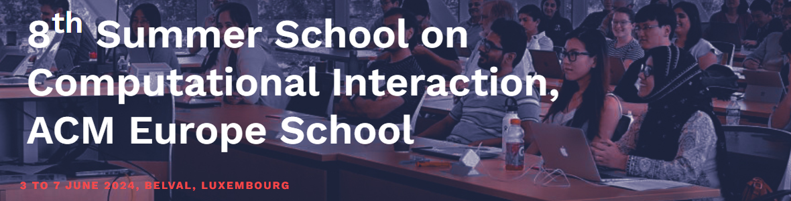
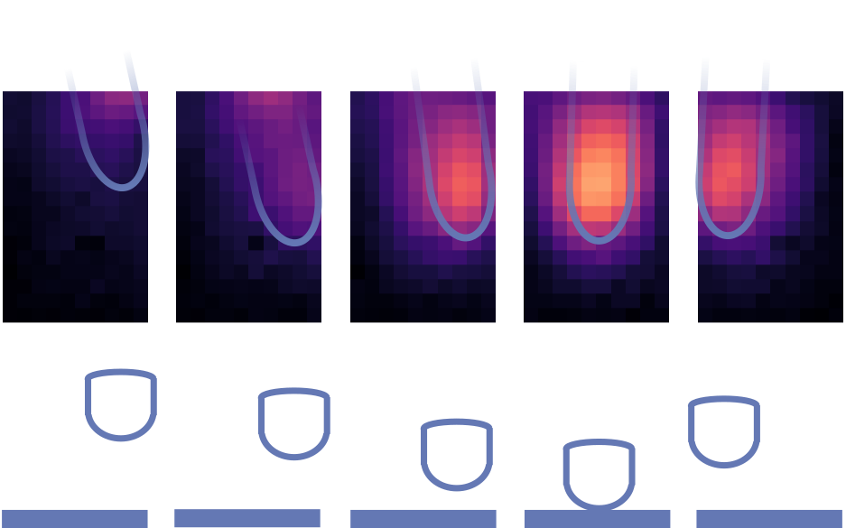

# CIX 2024: Forward and Inverse Modelling in HCI

* 8th International Computational Interaction Summer School 2024: Luxembourg
* Notes on forward and inverse modelling in HCI.
* **John H. Williamson**, *University of Glasgow*.

# Installation
* Create a virtual environment (e.g. if using conda `conda create -n cix2024_jhw`)
* Activate it (if necessary, e.g. `conda activate cix2024_jhw`)
* Install the requirements with `pip install -r requirements.txt`
* Open  [01_Introduction.ipynb](01_Introduction.ipynb) 

# Acknowledgements

Supported by the project **Designing Interaction Freedom via Active Inference (DIFAI)**, ERC Advanced Grant proposal 101097708, funded by the UK Horizon guarantee scheme as EPSRC project EP/Y029178/1.